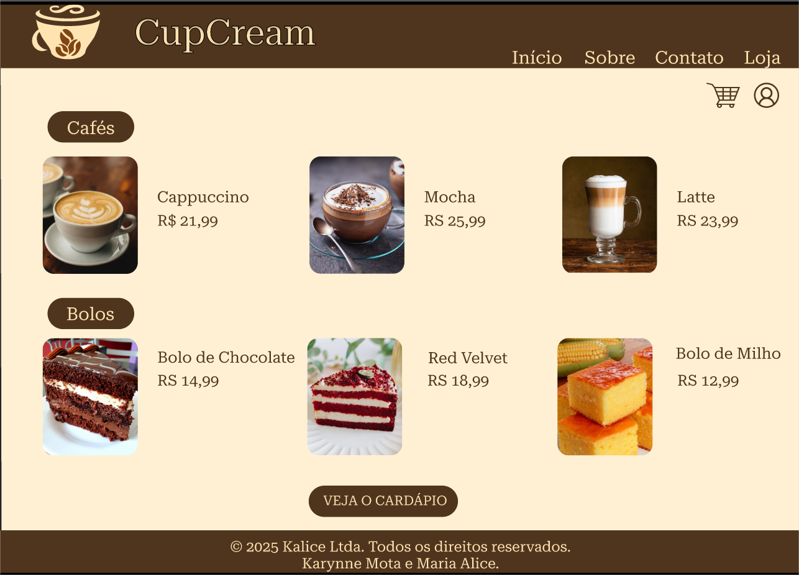
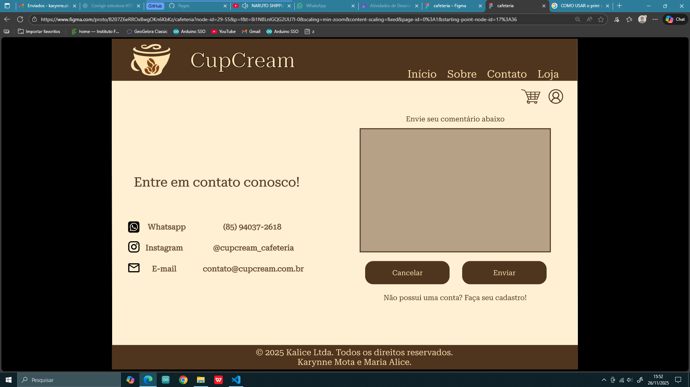
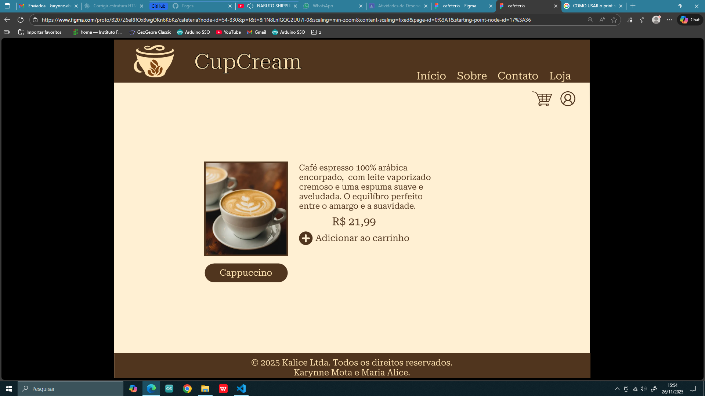
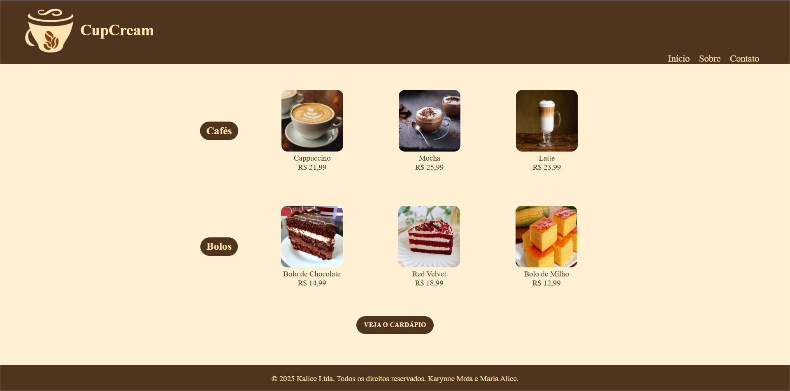
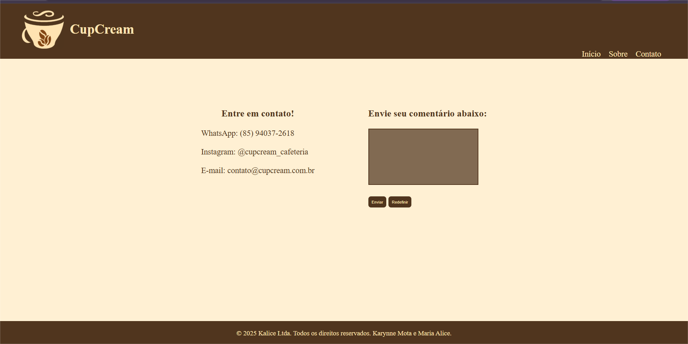
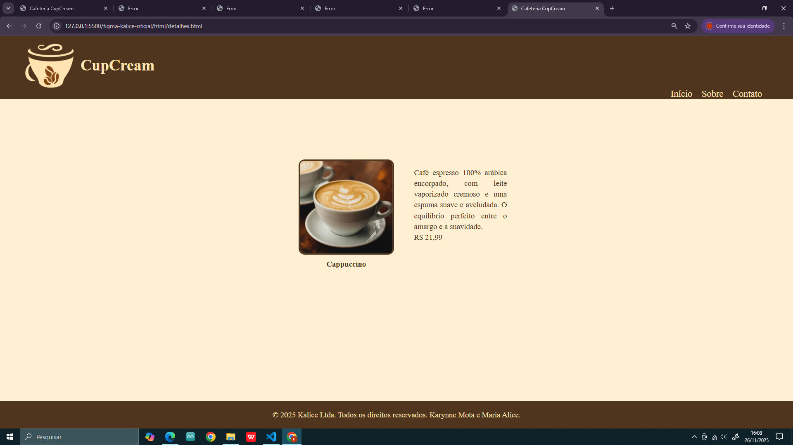

# 📌 3.6 Apresentação Final

## 🖼️ Protótipo no Figma  
### Página Inicial  

### Página Contato  

  ### Página Detalhes  

---

## 🖥️ Implementação em HTML/CSS  
### Página Inicial  

### Página Contato  

### Página Detalhes  

---

## ✨ Semelhanças e Diferenças entre o Design (Figma) e a Implementação (HTML/CSS)

### ✅ Semelhanças
- A paleta de cores foi mantida conforme o protótipo.
- A estrutura geral das páginas segue o layout planejado.
- Tipografia e tamanho dos títulos se aproximam do design do Figma.
- As mesmas imagens (ou equivalentes) foram utilizadas.
- Elementos arredondados e estilo visual dos botões/títulos foram preservados.

### ⚠️ Diferenças
- Ajustes naturais de espaçamento e alinhamento devido ao comportamento real do CSS.
- Algumas fontes podem diferir do Figma caso não estejam disponíveis no navegador.
- Agrupamento diferente de elementos (como título + imagem) para melhor responsividade.
- Dimensões das imagens podem variar levemente.
- Alguns detalhes visuais do Figma (sombras, efeitos, bordas) podem não estar idênticos no HTML/CSS.

